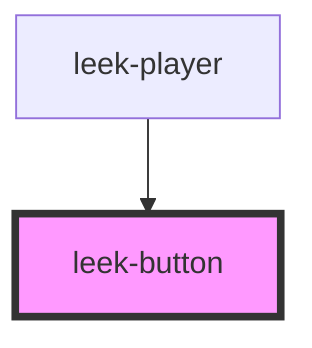

# leek-button

<!-- Auto Generated Below -->

## Properties

| Property | Attribute | Description             | Type                | Default   |
| -------- | --------- | ----------------------- | ------------------- | --------- |
| `icon`   | `icon`    | type of icon displpayed | `"pause" \| "play"` | `'pause'` |

## Dependencies

### Used by

 - [leek-player](../leek-player)

### Graph

----------------------------------------------

*Built with [StencilJS](https://stenciljs.com/)*
