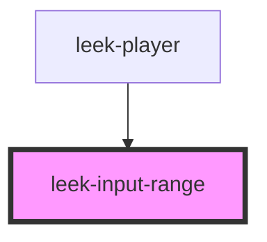

# leek-input-range

<!-- Auto Generated Below -->

## Events

| Event          | Description | Type                  |
| -------------- | ----------- | --------------------- |
| `updateVolume` |             | `CustomEvent<number>` |

## Dependencies

### Used by

 - [leek-player](../leek-player)

### Graph

----------------------------------------------

*Built with [StencilJS](https://stenciljs.com/)*
