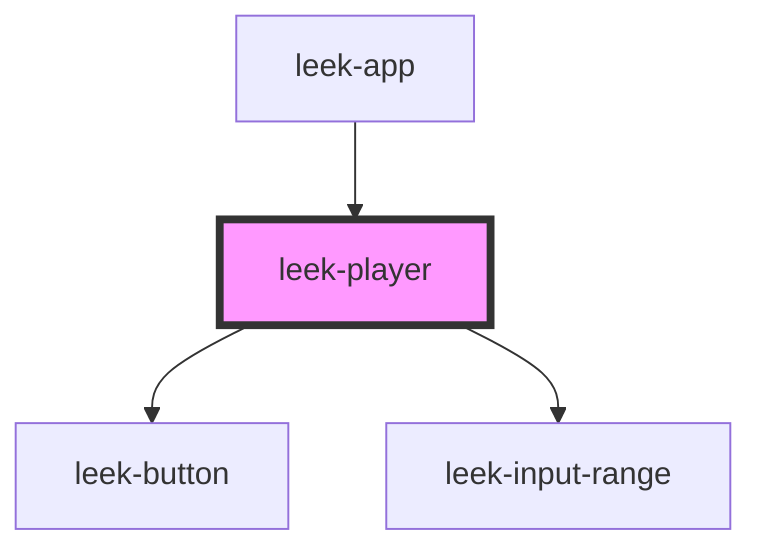

# leek-player

<!-- Auto Generated Below -->

## Events

| Event         | Description                                 | Type                   |
| ------------- | ------------------------------------------- | ---------------------- |
| `toggleState` | Event is emitted when the button is pressed | `CustomEvent<boolean>` |

## Dependencies

### Used by

 - [leek-app](../leek-app)

### Depends on

- [leek-button](../leek-button)
- [leek-input-range](../leek-input-range)

### Graph

----------------------------------------------

*Built with [StencilJS](https://stenciljs.com/)*
