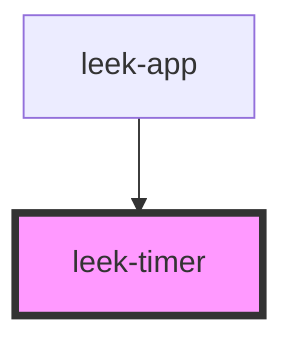

# leek-timer

<!-- Auto Generated Below -->

## Properties

| Property  | Attribute | Description                                               | Type      | Default     |
| --------- | --------- | --------------------------------------------------------- | --------- | ----------- |
| `playing` | `playing` | Indicate if audio is playing, if true timer can increment | `boolean` | `undefined` |

## Dependencies

### Used by

 - [leek-app](../leek-app)

### Graph

----------------------------------------------

*Built with [StencilJS](https://stenciljs.com/)*
